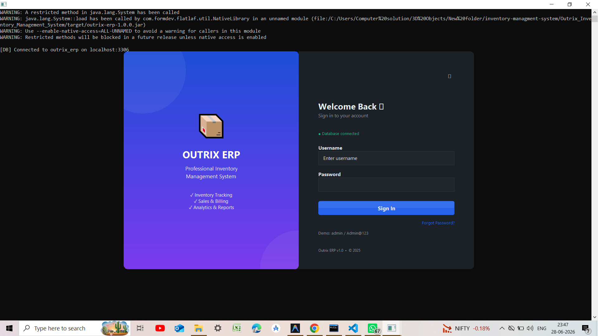
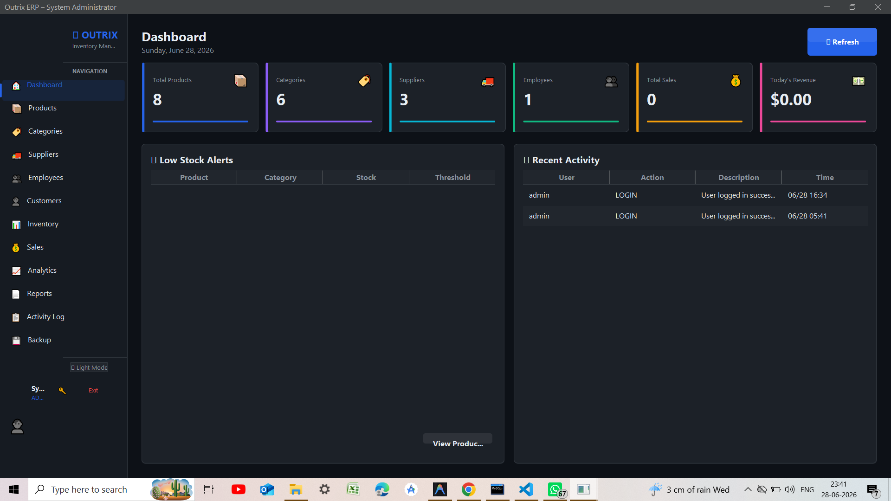
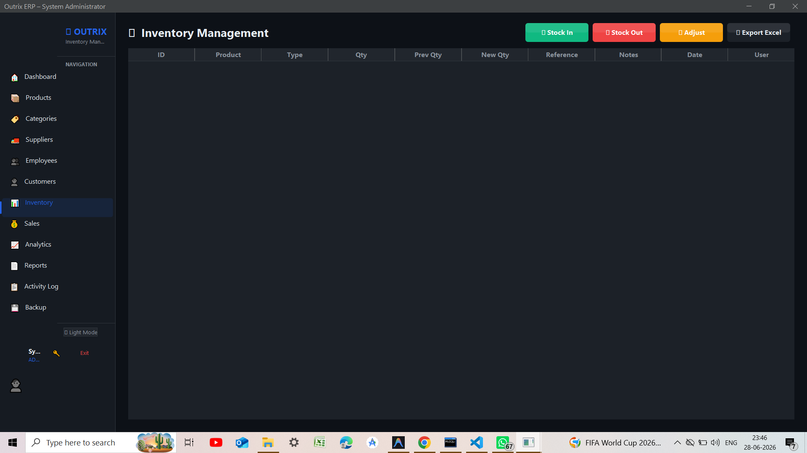
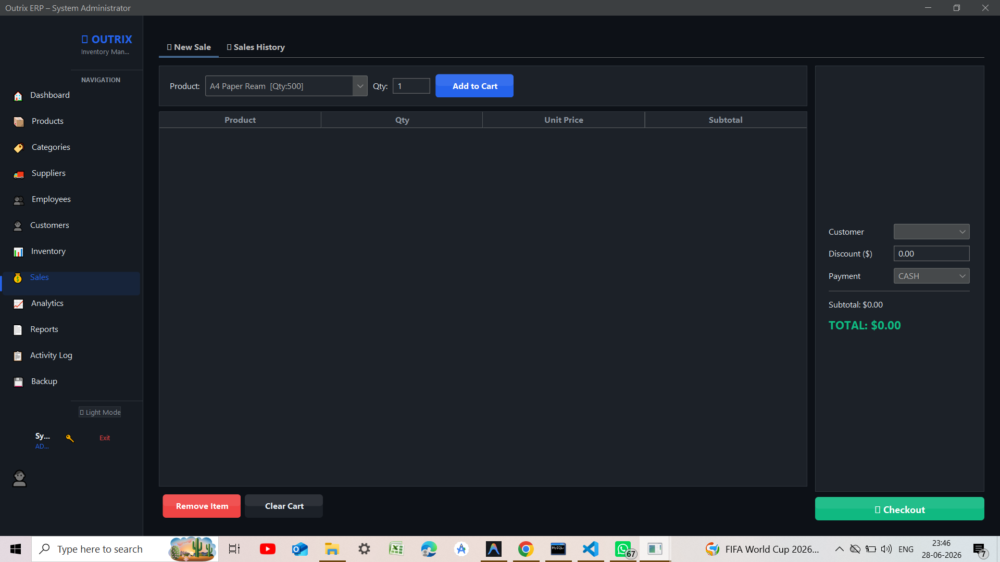
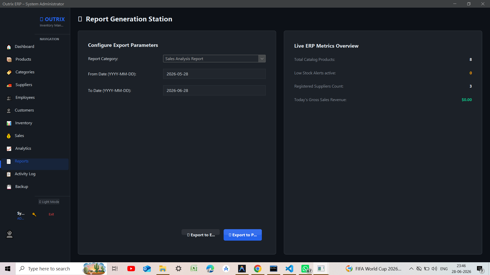

# 📦 Outrix ERP Inventory Management System

<div align="center">

# 🚀 Outrix ERP

### Modern Java-Based Inventory & Enterprise Resource Planning System

A professional **Java Swing Desktop ERP** built for businesses to efficiently manage inventory, sales, suppliers, reporting, and analytics through a clean and modern interface powered by **FlatLaf**.


</div>

---

# 📑 Table of Contents

* Overview
* Features
* Screenshots
* Tech Stack
* Project Structure
* Installation
* Configuration
* Running the Application
* Default Login
* Reports & Analytics
* Future Enhancements
* License

---

# 📖 Overview

**Outrix ERP** is a desktop-based Enterprise Resource Planning (ERP) and Inventory Management System developed using **Java Swing** and **MySQL**.

It simplifies inventory management by providing secure authentication, product tracking, supplier management, sales processing, professional reporting, analytics dashboards, barcode support, and automated backups.

Designed with a modern **FlatLaf Dark Theme**, the application offers a clean and intuitive user experience suitable for retail stores, warehouses, and small-to-medium businesses.

---

# ✨ Features

## 🔐 Authentication & Security

* Secure Login System
* BCrypt Password Hashing
* Role-Based Access Control
* Admin & Employee Accounts
* Audit Trail Logging

---

## 📦 Inventory Management

* Product Management
* Category Management
* Stock Monitoring
* Low Stock Alerts
* Automatic Stock Updates

---

## 🏷 Barcode & QR Code

* Barcode Generation
* QR Code Generation
* Barcode Scanning Support
* ZXing Integration

---

## 💰 Sales Management

* POS Billing
* Invoice Generation
* Discount Calculation
* Tax Calculation
* Automatic Inventory Deduction
* Receipt Printing

---

## 🚚 Supplier Management

* Supplier Records
* Purchase History
* Stock Procurement Tracking

---

## 📊 Dashboard & Analytics

* Revenue Charts
* Sales Statistics
* Product Category Analysis
* Inventory Metrics
* Interactive Graphs using JFreeChart

---

## 📄 Reports

Generate professional reports including:

* Product Report (PDF)
* Inventory Report (PDF)
* Sales Report (PDF)
* Excel Export (.xlsx)

---

## 💾 Backup System
* Database Backup
* Database Restore
* One-click Recovery

---

# 📸 Screenshots


## Login Screen





---

## Dashboard





---

## Inventory Management





---

## Sales Module





---

## Reports





---

## Barcode Generator


---

## Backup & Restore


---

> 📁 Create a folder named:

```
screenshots/
```

Example:

```
screenshots/
│── login.png
│── dashboard.png
│── inventory.png
│── sales.png
│── reports.png
│── barcode.png
│── backup.png
```

---

# 🛠 Technology Stack

| Technology | Purpose               |
| ---------- | --------------------- |
| Java 17+   | Core Application      |
| Java Swing | Desktop GUI           |
| FlatLaf    | Modern UI Theme       |
| MySQL 8.x  | Database              |
| JDBC       | Database Connectivity |
| Maven      | Dependency Management |
| BCrypt     | Password Security     |
| ZXing      | Barcode & QR Code     |
| Apache POI | Excel Export          |
| iText 7    | PDF Reports           |
| JFreeChart | Dashboard Charts      |

---

# 📂 Project Structure

```
Outrix_Inventory_Management_System
│
├── database
│   └── schema.sql
│
├── screenshots
│   ├── login.png
│   ├── dashboard.png
│   ├── inventory.png
│   ├── sales.png
│   └── reports.png
│
├── src
│   └── main
│       └── java
│           └── com
│               └── outrix
│                   ├── Main.java
│                   ├── config
│                   ├── dao
│                   ├── model
│                   ├── util
│                   └── view
│
├── pom.xml
├── run.bat
└── README.md
```

---

# 🚀 Installation

## Prerequisites

* Java JDK 17+
* MySQL Server 8.x
* Maven

---

## 1. Clone Repository

```bash
git clone https://github.com/yourusername/Outrix_Inventory_Management_System.git

cd Outrix_Inventory_Management_System
```

---

## 2. Create Database

Run:

```sql
source database/schema.sql;
```

---

## 3. Configure Database

Open

```
src/main/java/com/outrix/config/DBConnection.java
```

Update:

```java
HOST=localhost
PORT=3306
DATABASE=outrix_erp
USER=root
PASSWORD=your_password
```

---

## 4. Build

```bash
mvn clean package
```

---

## 5. Run

### Windows

```
run.bat
```

### Command Line

```bash
java -jar target/outrix-erp-1.0.0.jar
```

---

# 🔑 Default Login

| Role          | Username  | Password  |
| ------------- | --------- | --------- |
| Administrator | admin     | Admin@123 |
| Employee      | employee1 | Admin@123 |

---

# 📊 Reports

The system can generate:

* Product Report
* Sales Report
* Inventory Report
* Revenue Report
* Excel Export
* PDF Export

---

# 🚀 Future Enhancements

* Cloud Backup
* Email Notifications
* GST Billing
* Multi-Warehouse Support
* Customer Management (CRM)
* Purchase Orders
* Mobile Companion App
* Multi-language Support
* REST API Integration

---

# 🤝 Contributing

Contributions are welcome!

1. Fork the repository
2. Create a feature branch
3. Commit your changes
4. Push to your branch
5. Open a Pull Request

---

# 📄 License

This project is licensed under the **MIT License**.

---

<div align="center">

### ⭐ If you found this project useful, consider giving it a Star!

Made with ❤️ using Java & MySQL

</div>
